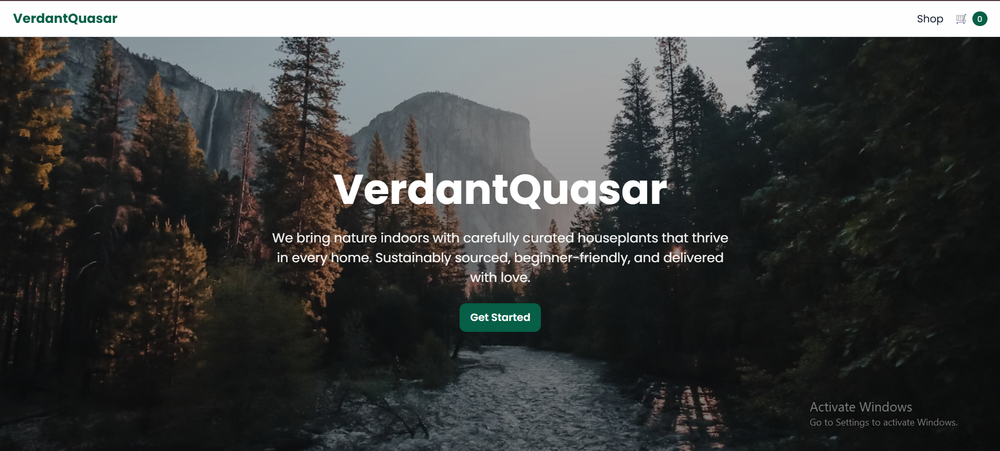
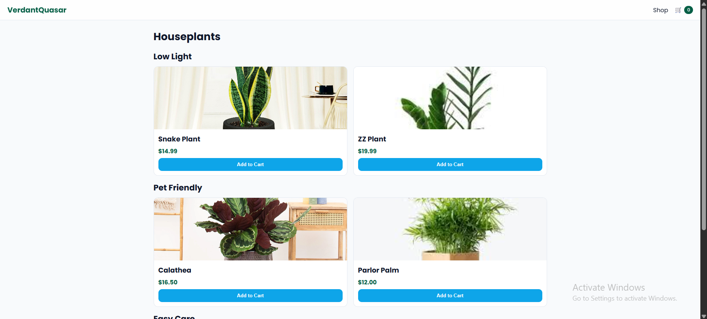
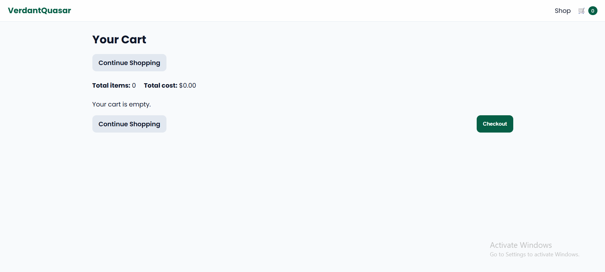

# VerdantQuasar – Houseplants Shop

A simple, responsive 3-page storefront built with plain HTML, CSS, and JavaScript. It includes a landing page, product listing with categories and Add to Cart, and a shopping cart with quantity controls, totals, and basic navigation.

## Author
- Creator: Jehadee L. Macadato

## What's new (latest changes)
- Organized assets into `css/` and `js/` folders for GitHub deployment.
- Added hover effects for images and buttons.
- Mobile responsive improvements at 768px and 480px.
- Added Redux-style store (`js/store.js`) with actions (ADD_ITEM/INC/DEC/DEL) and localStorage persistence.
- Added an extra "Continue Shopping" button at the top of the cart page.

## Pages
- Landing: `index.html` – background image, brand, company blurb, Get Started.
- Products: `products.html` – 6 plants in 3 categories, thumbnails, name, price, Add to Cart.
- Cart: `cart.html` – item list with image/name/price, increase/decrease/delete, totals, checkout alert, continue shopping (top and bottom).

## Features
- Shared header with cart icon and live count across pages.
- Add to Cart: increments count, disables button, persists to `localStorage`.
- Cart controls: increment/decrement/delete per item, recalculates totals.
- Responsive layout for mobile (768px and 480px breakpoints).
- Hover effects for product cards and buttons.

## Tech
- No frameworks; just static assets.
- State persistence via `localStorage` under key `verdantquasar_cart_v1`.
 - Redux-style store for state updates: `js/store.js`.

## Folder structure
```
  index.html
  products.html
  cart.html
  css/
    styles.css
  js/
    scripts.js
    store.js
  images/
    Assorted Succulent.avif
    Calathea.webp
    Golden Pothos.jpg
    Parlor Palm.jpg
    Snake Plant.jpg
    ZZ Plant.jpg
  README.md
```

## How to run locally
- Option 1: Open `index.html` directly in a browser.
- Option 2 (recommended for Chrome file:// restrictions): serve the folder with a simple server.
  - Python 3: `python -m http.server 8000` then visit `http://localhost:8000//index.html`.

## Screenshots (inline previews)
Place screenshots in `images/screenshots/` with these exact filenames so they render below in GitHub:

```
images/screenshots/
  landing.png
  products.png
  cart.png
```

Once added, previews will display here:

<div align="center">

<h4>Landing</h4>


<h4>Products</h4>


<h4>Cart</h4>


</div>

## Deploying to GitHub Pages
1. Push this folder to your GitHub repo.
2. In the repo settings, enable GitHub Pages for the `main` branch (root).
3. Access your Pages URL for `index.html` under your site.

## Customization
- Brand name is `VerdantQuasar` (change in all HTML titles/headers if you want).
- Images live in `images/`; product cards reference files by exact filename.
- To reset the cart, clear browser storage for this site or change `STORAGE_KEY` in `js/scripts.js`.

## Grading checklist mapping (for instructors)
- Landing page: background, paragraph, company name, CTA to products.
- Product listing: 6 unique plants, 3 categories, Add to Cart disables + increments + persists.
- Header: appears on products/cart, cart icon shows total items, nav between pages.
- Cart: total items, total cost, per-item thumbnail/name/unit price, increase/decrease/delete, checkout alert, continue shopping top and bottom.


